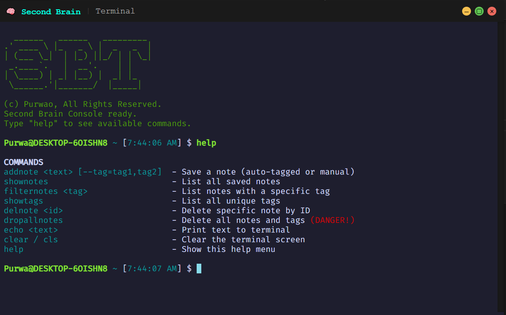

# Second Brain Terminal (SBT) 🧠💻

<p align="center">
 <br>
</p>


A terminal-style productivity app for managing notes with AI-powered tagging, built with Electron + React + Xterm.js.

## Features ✨
- **Smart Note-Taking**: Save notes with manual/auto-generated tags
- **Instant Search**: Filter notes by tags or content
- **Terminal UI**: Keyboard-focused workflow with syntax highlighting
- **Data Persistence**: SQLite database for local storage
- **AI Integration**: Automatic tag suggestions via transformers

## Installation ⚡
### Prerequisites
- Node.js v18+
- npm/yarn

### Quick Start
```bash
# Clone repo
git clone https://github.com/Purwao/2nd-Brain.git

# Install dependencies
npm install

# Run in development mode
npm run dev

# Build for production
npm run dist
```

## Key Commands ⌨️

| Command               | Description                                  | Example                              |
|-----------------------|----------------------------------------------|--------------------------------------|
| `addnote <text>`      | Save note (auto-tags if none provided)       | `addnote "Meeting notes" --tag=work` |
| `shownotes`           | List all notes in table format               | `shownotes`                          |
| `filternotes <tag>`   | Filter notes by specific tag                 | `filternotes urgent`                 |
| `showtags`            | List all unique tags                         | `showtags`                           |
| `delnote <id>`        | Delete note by ID                            | `delnote 42`                         |
| `dropallnotes`        | ❗ Delete ALL notes (confirmation required)   | `dropallnotes` → confirms with `y/n` |
| `echo <text>`         | Print text to terminal                       | `echo "Hello World"`                 |
| `clear`/`cls`         | Clear terminal screen                        | `clear`                              |
| `help`                | Show command help menu                       | `help`                               |
| `exit0`               | Close the application                        | `exit0`                              |


### Usage
```bash
# Add a note with automatic tagging
$ addnote "Buy milk tomorrow morning"
✅ Note saved with tags: shopping, reminder

# Add note with manual tags
$ addnote "Review PR #42 --tag=work,code"
✅ Note saved with tags: work, code

# List all notes
$ shownotes
ID   | Content                              | Tags
-----|--------------------------------------|------
#1   | Buy milk tomorrow morning           | shopping, reminder
#2   | Review PR #42                       | work, code

# Filter notes by tag
$ filternotes work
ID   | Content                              | Tags
-----|--------------------------------------|------
#2   | Review PR #42                       | work, code

# Delete a note
$ delnote 2
🗑️ Note #2 deleted

```
## DEMO

<p align="center">
 <br>
</p>

## License

[MIT](https://choosealicense.com/licenses/mit/) Purwao.

